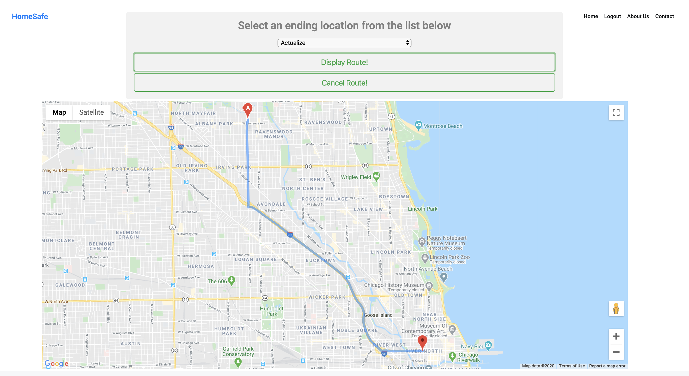

Brief Description:

Spending time with family and friends can be a wonderful occasion. At the end of the night when everyone goes home, most people are too tired to call or text everyone else confirming they reached home. So then how can we confirm that everyone arrived home safely? This application was created to do that for you. 

For example, I would login and create a journey and add members from the group that I spend time with. 

My route home would be displayed and my route home would be tracked with GPS. 

When I arrive home, the application will automatically send a message to the rest of the group confirming that I arrived.

The frontend to a full stack application which was written in Vue.js. The application, along with Rails and Vue.js, uses technologies such as Google maps, Geocoder, Twilio. 

